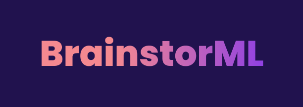

## Description
Web app that allows for automatic clustering and generation of ideas based on word embeddings, using Natural Language Processing models. 

## Design Applications: 
### Clustering
The main objective of this project is to develop and optimize a clustering model on word embeddings to assist brainstorm tasks.

### Labeling
It also assists with labeling main categories of clusters to start pattern recognition for Designers.

### Generation
Using Generative Machine Learning models, it provides nearest neighbor ideas for a selected group.

